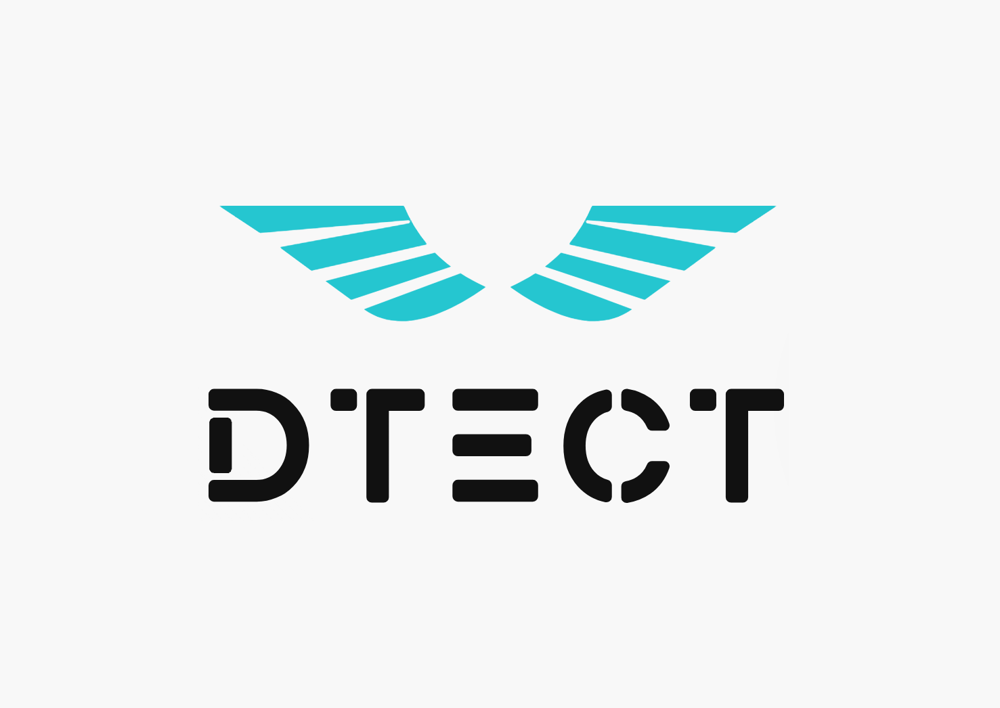
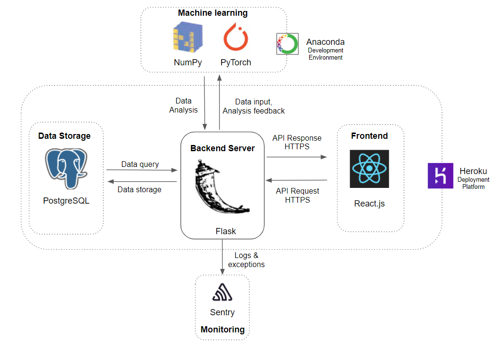

# Dtect

Dtect is a company founded in the data security industry. Dtect aims to perform user behaviour analysis in the workspace to detect insider threat. The main focus of Dtect is to display a comprehensive User Interface for behavioural events and explore Machine Learning solutions to behavioural analysis.

_This project is mentored by [DSCIL](https://dcsil.ca/) at the University of Toronto and the Royal Bank of Canada._

High-Level Architecture
---

The diagram shows the general architecture of the application.
PostgreSQL is used for storing the main behavioural data.
The back-end server as well as the machine learning module will be implemented using Python, while the front-end would be implemented with JavaScript, HTML, CSS.
The machine learning model will be developed and trained in an Anaconda environment offline. The trained model is deployed as a serialized file.
Further discussions are included in [StackShare.io](https://stackshare.io/dcsil/dtect).

Deployed MVP location: http://dtect-app.herokuapp.com/

Table of Contents
---

- [People](./team/)
- [Diversity](./team/diversity.md)
- [Product & Research](./product_research/)
    - [Roadmap](./product_research/roadmap.md)
    - [Accessibility](product_research/UIUX/Accessibility.md)
    - [Demo](demo/)
    - [service.yml](service.yml)
 
