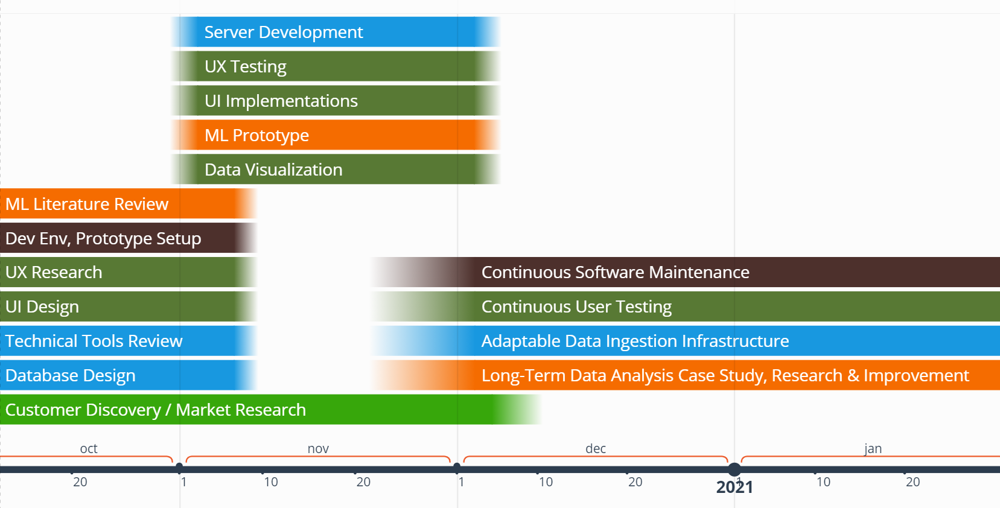

# Roadmap

## Overview
We want to focus on data visualization and data analysis for our MVP. As MVP delivery happens in December, the core components of the MVP would be the focus. 

As we wrap up the user research and literature review, we will be starting the technical implementations. Our priority is to utilize the feedback that we gathered from the research process and refine our prototype. We will also begin designing our ML architecture using the results from related literature reviews

Below is a visualization of the current version of our roadmap.

## Short Term

**Duration:** early Nov-mid Nov, 2020

We intend to wrap up the early design process and start developing components that are related to the research. These are immediate steps:
- ML Literature Review
    - Finish research on relevant machine learning technologies
    - Design ML architechture prototype
    - Implement the ML model
- Frontend Design & Implementation
    - Refine the user interface based on the feedback from the user research, modify user interactions and how data is represented on the UI
    - Implement the mockup as our front end
- Database Design

## Medium Term

**Duration:** mid Nov-early Dec, 2020

We plan to launch a barebones alpha version in the medium term. This includes implementing a backend server and connecting the server with the frontend and the ML model.
- We will also make sure the product is scalable and extendable in the development process.

## Long Term

**Duration:** 2021

We intend to extend a data ingestion infrastructure to allow flexibility in data input streaming. Furthermore, we strongly believe that further machine learning research and testing should continue beyond the MVP. With a flexible ingestion infrastructure, we can expand validation with more data. A case study and perspective evaluation is needed to further understand hidden data correlations and modelling. We eye for a mid-2021 launch, followed by continuous maintenance and feature improvement cycles.
