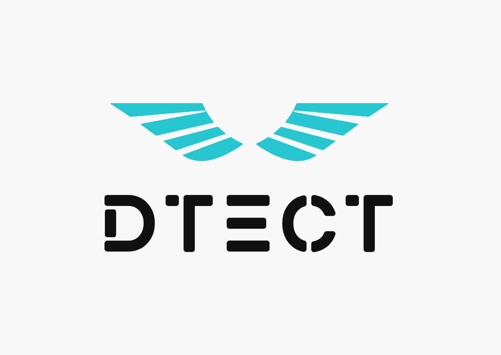

People at Dtect
---

- [Rutwa Engineer, Business Analyst](./rutwa.md)
- [Xi Huang, Business and Engineering](./xi.md)
- [Weiyuan (Carl) Che, Business and Engineering](./carl.md)
- [Or Aharoni, Business and Software Developer](./Or.md)
- [Alan Chen, Business and Engineering](./alan.md)

Team Principles
---

**Communication** 

- **Team meetings** will be held at least weekly for progress planning and updates 

  - Weekly meetings require all team members to participate. 

  - If a member cannot make it to a meeting, the rest of the team need to be notified as soon as possible. Preferably an hour before the meeting. 

    - The team should discuss the possibility of rescheduling the meeting. However, if a meeting is held without full participation, all members need to be updated on the progress and relevant discussion. 

  - Team members are encouraged to take notes on major topics during the meetings. 

  - A brief summary will be provided in the group chat and saved to the chat on a weekly basis. 

- Team members are encouraged communicate daily on the **Microsoft Teams group**. 

  - Team members are expected to check the group chat daily. 

    - Inform the team of absence longer than a day. 

  - General questions and discussions can be posed to the group. However, important discussions ought to be documented. 

    - Team members are encouraged to label messages they deem important with the in-app emoji reactions. 

    - If a message is targeted towards a specific team member, make sure to tag them in the message. 

- Communications with personal phone numbers are for urgent matters only. 

- It is each member’s responsibility to be aware of the progress of the course and its deadlines. 

  - It is recommended to remind the team of recent updates or upcoming deadlines 

  - Members in CSC491 should make sure to inform the rest of the team regarding project-related updates and deadlines from CSC491. 

- Team members share a common goal. Communication is key. 

  - We will try our best to accommodate and help each other when difficulties occur. 

  - When disagreement occurs, make sure to explain your standpoint and communicate with fellow teammates. 

    - Disagreements can be resolved with team-wide voting. We will be using the MS Team Forms plug-in to facilitate the voting. 

    - The team need to be informed of opinions and reasons from each side of the disagreement. 

**Work** 

- Tasks will be delegated as fairly as possible during meetings. 

  - Each member should keep the team informed of their upcoming time allocation for the sake of progress planning and task assignments. 

  - Tasks should be assigned reasonably based on team members’ expertise, upcoming workload, schedule, etc. 

  - Expected internal deadlines for each task should be proposed at beginning of the assignment. 

- **General team roles** 

  - *Rutwa* will be heavily invested on the business development and project management side of the startup. This means being focused on the market analysis, establishing the target audience, and figuring out the finances. We believe her background in business analysis at a government level is relevant and transferable in this context.  

  - *Xi* will work on not only the software development aspects with more focus on back-end development and data analysis, but also business research and analysis. 

  - *Or* is invested on the business development and project management side of the startup. However, she can help with the code a bit if necessary. 

  - *Carl* will work on software development with an even focus on back-end and front-end/UX. He will also contribute in the business research and development. 

  - *Alan* will be mainly focused on data engineering and backend development. He will also help with frontend development, data analysis and business development. 

 

- Tasks will be displayed on the **Kanban board** on MS Teams.

  - It is every member’s responsibility to keep their tasks updated on the board. 

  - Team members are encouraged to look at the board on a regular basis in order to keep track of the overall progress. 

 

 

- It is each member’s responsibility to complete their work in a reasonable amount of time. 

  - Inform of the team regarding unforeseen delays and difficulties. Tasks can be reassessed and reassigned by the team. 

  - It is highly recommended to submit work as early as possible to allow adequate review and discussion from the rest of the team. 

- **GitHub pull requests** should only be merged after it has been reviewed by every relevant team member. 

  - Make sure to assign reviewers when creating the pull request. Send them a message on Teams to let them know about the pull request. 
