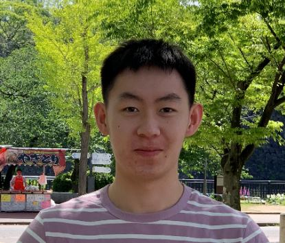

# Alan Bo Lin (Alan) Chen

- Software Developer
- alan.chen@mail.utoronto.ca

## Links

- [GitHub](https://github.com/chenala)
- [LinkedIn](https://www.linkedin.com/in/chenala/)
- [Resume](https://learnsoftware.engineering/profiles/140)

## About Alan

Alan is a fourth year computer science student with focus in Artificial Intelligence and a minor in statistics. He has experience with backend development as an software engineering intern at Ritual Technologies and has also done frontend development for several projects at Evenset Inc. He was a teaching assistant for discrete mathematics (CSCA67) at UTSC. On his spare time, Alan likes to play sports, especially badminton. 

## Strengths

- Strong commitment and hard-working
- Great attitude
- Teamplayer

## Weaknesses

- Not asking enough questions
- Should spend more time on the drawing board
- Too competitive at times
